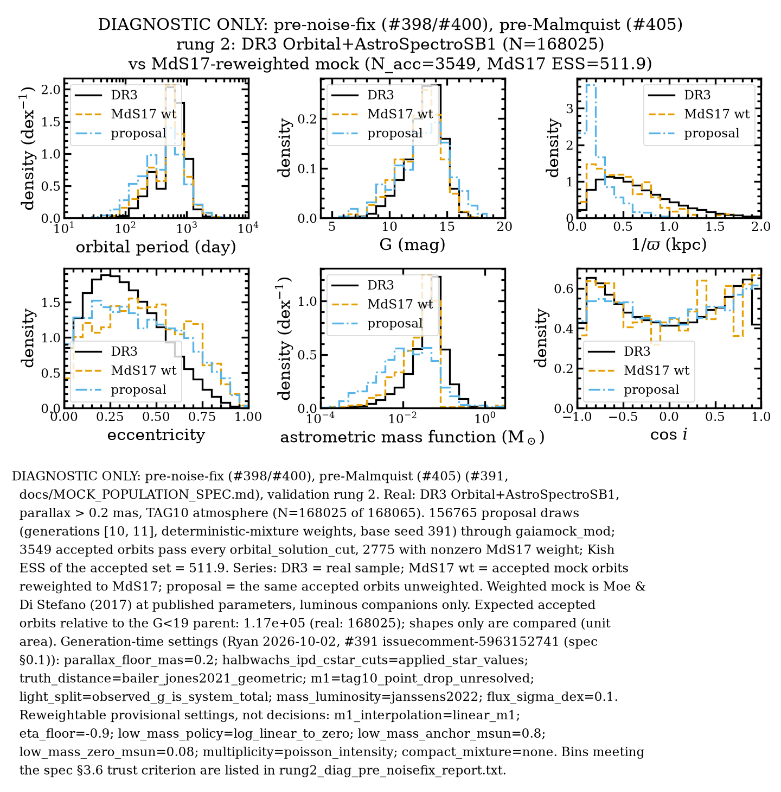
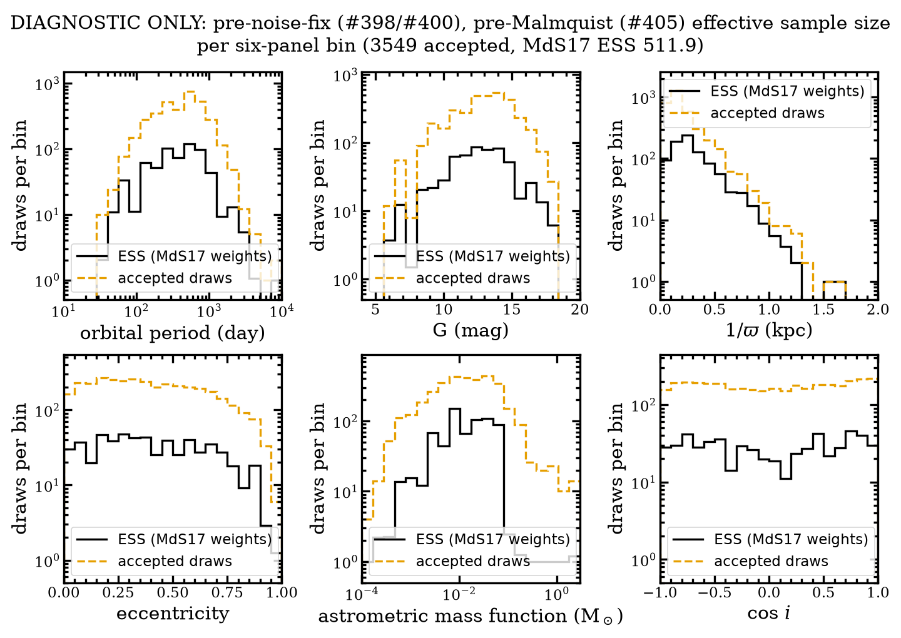

# #391 rung 2: MdS17-reweighted mock vs DR3. DIAGNOSTIC ONLY (pre-noise-fix, pre-Malmquist); run PAUSED

Issue #391. Spec: `docs/MOCK_POPULATION_SPEC.md` (decisions §0.1). Code: PRs #395 and #397.

**Status: diagnostic only, not a science result.** The figures are **pre-noise-fix**: they use the
old epoch and noise model, which #398 and #400 replace. They are also **pre-Malmquist**: the
magnitude-limit weights of #405 for Gaia-star primaries are not yet applied. Both changes will move
every panel. What remains valid is the plumbing and the measured ESS per CPU-hour. The full laptop run (generation 11)
was **paused at 154,518 of 370,000 draws** on 2026-10-02 at 23:34 PDT. The pause followed Ryan's
approval of the forward-model noise and epoch fixes (#398, #400; PR #404, `docs/gate399/README.md`).
Any change to the epochs or the noise invalidates every stored draw. The full run restarts once the
new model lands. All outputs are kept.

## What ran

| Generation | Config | Draws | Accepted orbits | Workers | Wall | CPU |
|---|---|---|---|---|---|---|
| 10 (tuning) | `config/population/proposal_set_decided_tune.yaml` | 2,500 | 52 | 2 | 24.2 min | 0.72 CPU-h |
| 11 (full, **paused**) | `config/population/proposal_set_decided_full.yaml` | 154,265 used, 154,518 completed of 370,000 planned | 3,497 | 8 | 5.57 h | 40.6 CPU-h |

- Parent: `data/dr3/gaia_snapshots/20261002T234408Z_gaia_source_parent_K1000000_plx0p2_bj`. That is
  K = 10⁶ and 214,666 rows. After the decided filters 164,397 are usable (attrition in
  `rung2_diag_pre_noisefix_report.txt`), 519 of them flagged as giants.
- Generation 11 was assembled from its partial JSONL by `scripts/assemble_partial_generation.py`. It
  uses the contiguous prefix of completed draws (154,265), which is an iid sample of the proposal,
  so the mixture weights use n = 154,265. The 253 draws that finished past the prefix are left out.
  Sanity check: for the 3,497 accepted orbits the median |parallax pull| (fit − truth) is 0.70 and
  the median |ΔP/P| is 0.003.
- Generations 10 and 11 are combined with deterministic-mixture weights (spec §3.7).
- Peak RSS: 0.53 GB for the parent process. Each worker is about 0.2 GB. The partial JSONL is
  72 MB, about 0.47 kB per draw.

## Measured efficiency (the number that sizes the restart)

| | Accepted-set MdS17 Kish ESS | CPU-h | ESS per CPU-h | ESS per wall-hour at 8 workers |
|---|---|---|---|---|
| Generation 10 | 13.6 | 0.72 | 19 | (2 workers) |
| Generation 11 | 500.3 | 40.6 | **12.3** | **≈ 90** |
| Combined | 511.9 | 41.3 | 12.4 | |

- Cost by outcome: about 13–14 CPU s for any draw that reaches the 12-parameter fit (accepted or
  not), and ≤ 0.01 CPU s for any other draw. The mean is 0.95 CPU s per draw.
- At this efficiency, an accepted-set ESS of 2,000 needs **≈ 160 CPU-h ≈ 21 h wall at 8 workers**,
  which is about 1.3 × the approved 125 CPU-h. The new noise and epoch model may change the cost per
  draw and the acceptance rate, so re-measure with a short tuning generation before sizing the
  restart.
- Largest weight share among accepted draws: 0.010, so no single draw dominates.

## Rung-2 comparison (diagnostic: pre-noise-fix, pre-Malmquist)

- Real sample: DR3 Orbital + AstroSpectroSB1 with the mirror filters of spec §0.1 (ϖ > 0.2 mas, TAG10
  atmosphere), 168,025 of 168,065 rows.
- **KS (spec §3.6 gate): not computed for any panel.** No bin meets σ_MC/σ_Poisson < 0.1
  (ESS_b ≥ 100 N_b, with N_b in real-count units of ~10⁴). As the spec anticipated, this criterion
  cannot be met at rung 2 on the laptop. The minimum ESS for drawing a rung-2 bin is still
  **MP-Q19** for Ryan.
- Weighted KS, informational only (not a gate; n_eff ≈ 510):

  | Panel | D | p |
  |---|---|---|
  | P | 0.127 | 1.3e-7 |
  | G | 0.125 | 2.4e-7 |
  | 1/ϖ | 0.165 | 1.6e-12 |
  | e | 0.188 | 4.4e-16 |
  | f_m | 0.249 | 5.5e-28 |
  | cos i | 0.032 | 0.66 |
- Qualitative, by eye (old noise model, no Malmquist weights):
  - cos i is reproduced, including the edge-on deficit.
  - P and G are close.
  - The mock is **more eccentric** than DR3, the same direction as El-Badry et al. (2024) Fig. 5.
  - f_m is cut off sharply near 0.06 M⊙. Luminous MS companions under q ≤ 1 with the Janssens
    mass–luminosity relation cannot produce larger photocentre mass functions. The real high-f_m
    tail needs the compact-object mixture (MP-Q17) or q > 1 / triples.
  - 1/ϖ is somewhat closer in than the real sample. This is exactly where the missing Malmquist
    weights (#405) would act.
- Solution-type mix (MdS17-weighted expected counts relative to the G < 19 parent): 1.17 × 10⁵
  accepted orbits vs 168,025 real; 2.0 × 10⁵ published accelerations. The real denominator is still
  ELBADRY2024 Q7 / MP-Q20. Full table in `rung2_diag_pre_noisefix_report.txt`.

## Observations to carry forward

- **Few giants.** Only 519 of the 164,397 usable parent stars are flagged as giants. TAG10 prefers
  MSC parameters, and MSC fits every source as an unresolved pair of main-sequence stars, so
  `logg_msc1` is dwarf-like by construction. The same applies on the real side. Related to #393.
- **The 0.1 MC-noise rule is a rung 3–5 criterion for compact-object bins.** It cannot gate luminous
  rung-2 bins (MP-Q19).

## Outputs (gitignored; kept on the laptop)

Worktree `../dark-hunter_pop-worktrees/mock-population-decisions-391/output/proposal_set/`:
- `decided_gen10_tune.h5`
- `decided_gen11_full.partial.jsonl` (154,518 completed draws)
- `decided_gen11_partial.h5` (assembled)
- `gen11.log`
- `launch_gen11.sh`

## 2026-10-03: decisions wired in; restart smoke (plumbing only)

The 2026-10-03 decisions (spec §0.2) are implemented:
- the bounded MdS17 eccentricity proposal (#409, #410);
- the Malmquist weight (#405), with Combined19 A_G (MP-Q29), Gaussian distance marginalization (MP-Q30) and a fitted zero point and σ_int (MP-Q25);
- the real-side IPD/C\* drop (MP-Q24: 168,025 → 167,911 rows, exactly the 114);
- the ESS ≥ 30 shading and KS gate (MP-Q19);
- the epoch-model hook (#400 E1);
- BLAS pinning (verified: OpenBLAS and OpenMP at 1 thread in every worker) and `nice` (#408).

**MP-Q25 fit (`malmquist_zero_point_fit.json`):** zp = −2.357 ± 0.006 mag and σ_int = 2.082 ± 0.007 mag on 161,776 RUWE < 1.4 dwarfs. The statistical error is far below the closed loop's 0.05 mag tolerance, but the fit is **not physically meaningful**:
- ΔM runs from +0.64 mag at d < 0.5 kpc to −2.94 mag at 2–5 kpc.
- It also runs from −3.0 mag at M1 < 0.6 M⊙ to +0.2 mag at M1 > 2 M⊙.
- The causes are the TAG10 floor (#393) and evolved stars that MSC fits as dwarfs (MP-Q28).
- Escalated as **#414**. With σ_int ≈ 2 mag the weight is nearly flat.

**Smoke (generation 20, `config/population/proposal_set_restart_smoke.yaml`)** ran 1,000 draws with the #400 epoch model on, taken from its open branch (merged locally, not pushed), at 2 workers under `nice`:
- 21 accepted orbits, ESS 5.5;
- 0.78 CPU s per draw on average; a draw that reaches the orbital fit costs about 10 s (13 s before the epoch model);
- 10.6 min wall, 0.22 CPU-h.

Figures and the report are plumbing checks only (`smoke_epoch_report.txt`).

**Projected full restart:** target accepted-set ESS ≈ 2,000.
- Basis: the paused generation 11 ran at 12.3 ESS per CPU-h; the epoch model makes draws about 18% cheaper. The smoke itself gives about 25 ESS per CPU-h, but from only 21 accepted orbits.
- Cost: ≈ 130 CPU-h (range 80–165), ≈ 16–21 h wall at 8 workers, ≈ 430k draws, ≈ 0.4 GB disk.
