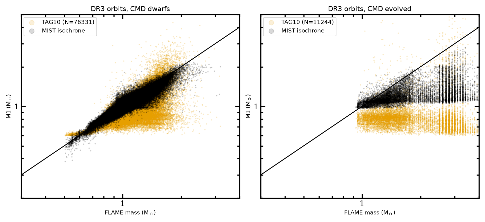
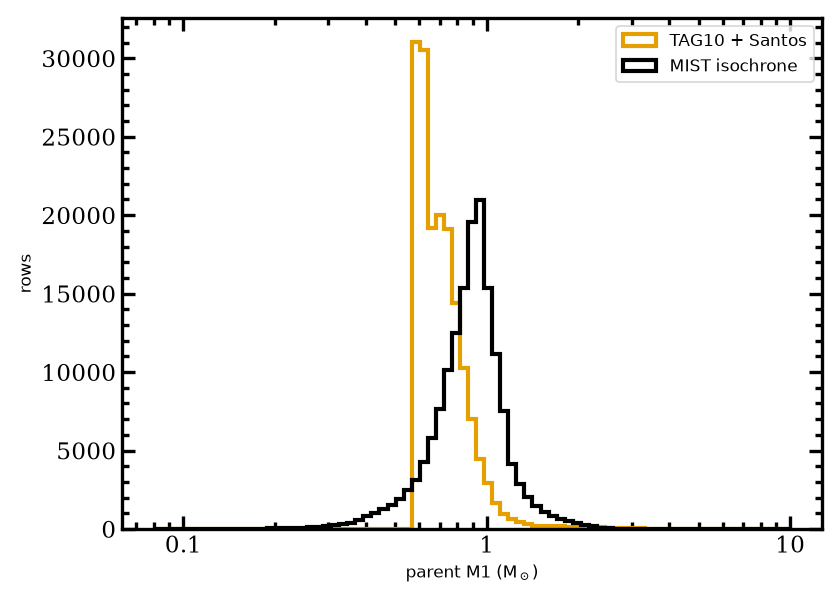
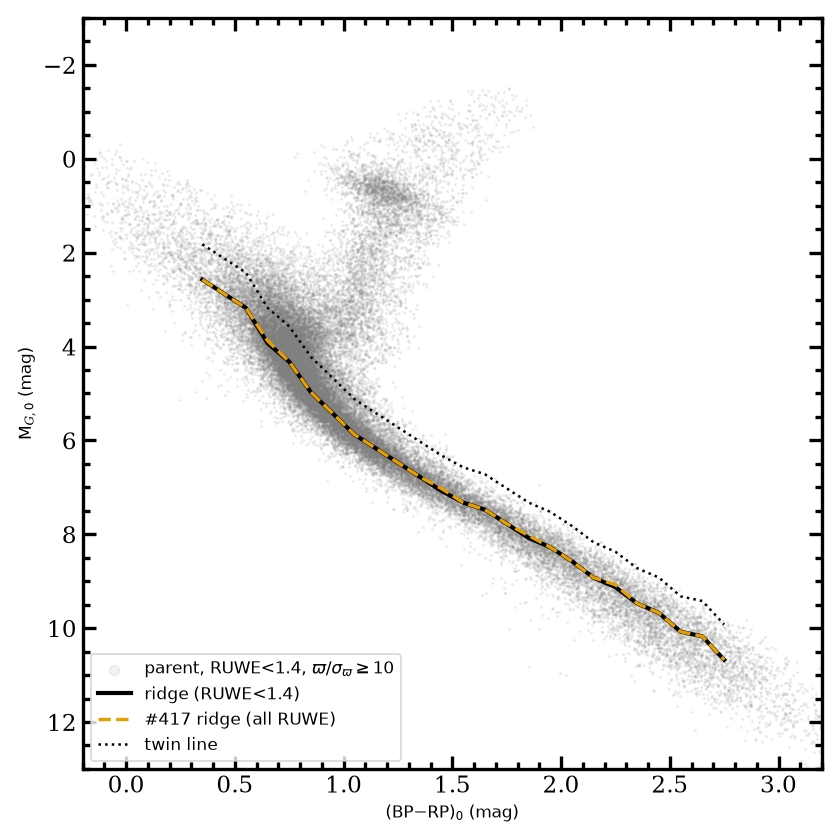
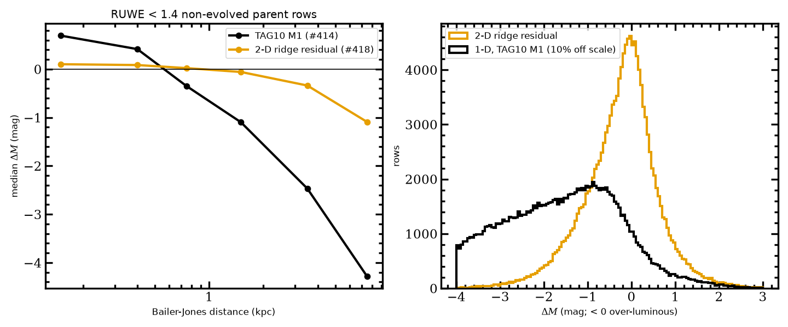
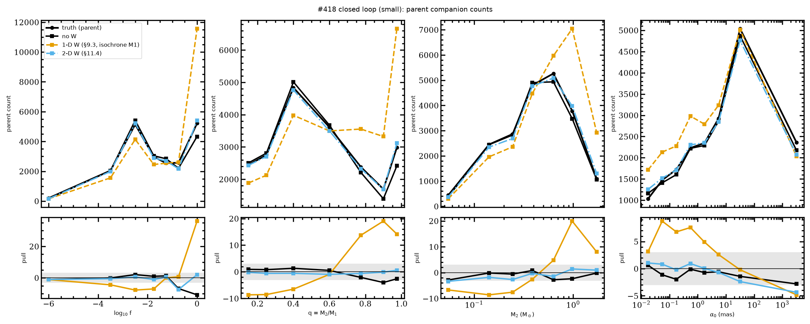

# Gate 418: MIST isochrone M1 and the 2-D CMD Malmquist weight

This gate reports the implementation of #418. Ryan's decisions are recorded in `docs/MOCK_POPULATION_SPEC.md` §0.3, and the design is in §11 (spec PRs #420 and #423). **Every `provisional_*` setting is still an open option for Ryan (MP-Q33–Q39).** The data-side switch has its own PR, and its numbers are in `bulk_remeasure.txt`.

Code:
- `src/darkhunter_pop/isochrone_mass.py`
- `src/darkhunter_pop/malmquist_cmd.py`
- `src/darkhunter_pop/malmquist_cmd_closed_loop.py`
- the `proposal_set` isochrone parent mode, the evolved flux target (#416), and the `malmquist_cmd_log_weight` hook
- `proposal_set.simulate_one` now goes through `epoch_model.run_cascade`

Configs:
- `isochrone_mass` in `config/config.yaml`; `mist_root` is a host path, also set in `host_profiles/laptop.yaml`
- `config/population/malmquist_cmd.yaml`
- `config/population/malmquist_cmd_closed_loop.yaml`
- `config/population/proposal_set_isochrone_smoke.yaml`
- `giants.ridge.ruwe_max: 1.4`

## Isochrone M1

The grid is MIST v1.2 (vvcrit 0.4) read in place from `/Users/rfoley/.isochrones`:
- [Fe/H] from −2.0 to +0.5;
- log age from 8.0 to 10.15;
- phases MS, SGB/RGB, CHeB, EAGB and TPAGB;
- UBVRIplus `Gaia_*_EDR3` bolometric corrections;
- EEP-matched sub-steps to 0.05 dex in [Fe/H] and 0.0125 dex in age, about 8.7 × 10⁶ points.

The parsed grid is cached at `data/isochrone_mist/native_<key>.npz` with a SHA256. Building it from the raw files takes about 60 s; building the map takes about 20 s.

The fit takes about 2 × 10⁵ stars per 1–3 minutes on one thread under load.

Priors are a Kroupa IMF, a constant SFR, and [Fe/H] ~ N(−0.1, 0.25) (provisional). The likelihood floors are 0.02 mag in colour and 0.05 mag in M_G, and ε = 0.1 is the fractional E(B−V) error (provisional).

### Validation against FLAME (real DR3 Orbital + AstroSpectroSB1, CMD-classified with the shared ridge)

| sample | N with FLAME | isochrone / FLAME median (16–84%) | bias | robust scatter | TAG10 / FLAME median (scatter) |
|---|---|---|---|---|---|
| CMD dwarfs | 75,259 | **0.999** (0.924–1.070) | −0.000 dex | **0.033 dex** | 0.923 (0.058 dex) |
| CMD evolved | 11,602 | **0.780** (0.494–0.971) | −0.108 dex | 0.132 dex | 0.526 (0.216 dex) |

Dwarfs, split by FLAME mass:

| FLAME mass (M⊙) | isochrone / FLAME |
|---|---|
| < 0.8 | 1.022 |
| 0.8–1.2 | 1.020 |
| 1.2–2.0 | 0.953 |
| > 2 | 0.863 (N = 243) |

Evolved stars, split by FLAME mass:

| FLAME mass (M⊙) | isochrone / FLAME |
|---|---|
| 0.8–1.2 | 0.995 |
| 1.2–2.0 | 0.845 |
| ≥ 2 | 0.525 |

For giants the CMD alone is mass-degenerate (the red clump and RGB of 1–3 M⊙ overlap), so the prior decides. The Kroupa IMF plus a constant SFR favour old, low-mass giants. FLAME uses its own grid and has a floor near 0.9 M⊙ and gridded stripes (`m1_vs_flame.png`). The isochrone/FLAME ratio for giants is therefore a statement about priors, not a calibration. Asteroseismic masses (APOKASC-3) would settle it; that is an option.

TAG10 underestimates giant masses by a factor of about 2. Isochrone M1 cuts that to about 0.78 at the median.



### Benchmarks

- **Gaia BH1, BH2 and BH3.** The published luminous-star masses are now in `config/benchmarks/known_truth_gaia_bh.yaml`. They are compared in the data-side PR, in `bulk_remeasure.txt`.
- **Eclipsing binaries (DEBCat, Southworth 2015) were not compared.** The catalogue is public at https://www.astro.keele.ac.uk/jkt/debcat/debs.dat, but saving it requires a file download, which needs the user's explicit permission. It is an open item.

### Parent

| | isochrone | TAG10 + Santos |
|---|---|---|
| usable rows | 160,330 | 164,397 |
| M1 at the 1/5/25/50/75/95/99th percentiles | 0.36 / 0.52 / 0.77 / 0.92 / 1.06 / 1.47 / 2.03 | 0.60 / 0.60 / 0.61 / 0.68 / 0.78 / 0.99 / 1.39 |
| rows below 0.6 M⊙ | 8.8% | 16.9% |

The #393 floor is gone.

Of the 214,666 rows:
- 6,374 have no CMD;
- 7,827 are off the isochrone grid (prior-predictive density < 10⁻⁴ mag⁻²). Most of these are high E(B−V); with ε = 0 the count was 11,306.

The median σ_log M1 is 0.041 dex, and σ_M1/M1 exceeds 0.25 for 2.1% of rows (#380 territory).



## Shared ridge and the MP-Q25 replacement

There is one ridge, measured on usable parent rows with ϖ/σ_ϖ ≥ 10 and RUWE < 1.4. It is used by the §10.2 evolved classifier and by the 2-D weight. It is almost identical to the #417 ridge, because nearly all parent rows have RUWE < 1.4. The parent evolved fraction is 7.04% with both ridges. On the real side it is 14.37% (Orbital only: 9.98%).



**New calibration** (replacing MP-Q25's zp = −2.36, σ_int = 2.08): ΔM_2D = M_G0 − R(C0) on 140,798 usable, RUWE < 1.4, non-evolved rows. The pooled mode is +0.024 ± 0.016 mag (bootstrap), against the closed loop's 0.05 mag tolerance; the robust σ is 0.67 mag. The #414 tables, re-measured:

| d (kpc) | n | mode | median | old 1-D TAG10 median (#414) |
|---|---|---|---|---|
| < 0.3 | 1,453 | +0.03 | +0.07 | +0.71 |
| 0.3–0.5 | 3,804 | +0.01 | +0.06 | +0.40 |
| 0.5–1 | 15,408 | +0.07 | +0.02 | −0.38 |
| 1–2 | 39,953 | −0.02 | −0.04 | −1.15 |
| 2–5 | 74,096 | −0.15 | −0.25 | −2.52 |
| > 5 | 5,058 | −0.76 | −0.94 | −4.35 |

| isochrone M̂1 (M⊙) | n | mode | median |
|---|---|---|---|
| < 0.6 | 13,310 | +0.09 | +0.00 |
| 0.6–0.8 | 32,890 | +0.07 | −0.02 |
| 0.8–1.2 | 85,377 | −0.09 | −0.17 |
| 1.2–2.0 | 9,184 | −0.60 | −0.48 |

The multi-magnitude systematics are gone. Two residual trends remain:

1. **Beyond 2 kpc the median is −0.2 to −0.9 mag.** That is what a magnitude-limited parent should show: at large d, only the bright side of the single-star distribution and the binaries survive G < 19. It is not a calibration error. The weight conditions on each row's own photometry, so the selection cancels (§9.2).
2. **M̂1 > 1.2 M⊙ sits −0.6 mag.** These rows are turnoff stars and early subgiants that are not flagged as evolved. This is the bright-side tail behind MP-Q39.



## Closed loop (spec §11.5)

The small run has 10⁶ primaries and 40,151 usable parent rows. Primaries are drawn from the MIST prior and include evolved stars. Companions are MdS17. Companion BP and RP come from MIST at the primary's own age and [Fe/H], and evolved primaries use the §10.4 flux relation. Synthetic E(B−V) is known to 5%, and the colour error is 0.01 mag. The pipeline runs dereddening, then isochrone M̂1, then the ridge measured from the synthetic parent, then the weights.

Isochrone M̂1 against the true M1:
- singles: +0.005 dex, with 0.044 dex scatter;
- binaries: +0.011 dex;
- twins: +0.04 dex. This is the blended-light bias of §11.3.

| weight | total (truth 20,702) | twins q > 0.95 | brightest log f bin | max \|pull\| |
|---|---|---|---|---|
| none | −2.3σ (CMD-dwarf rows −7.7σ) | −2.6 (dwarf rows −9.7) | −10.8 | 10.8 |
| 1-D §9.3 with isochrone M̂1 | +12.9σ | +14.2 | +36.1 | 36.1 |
| 2-D, Gaussian ridge | +0.4σ (dwarf rows −0.2) | −2.1 (dwarf rows −6.2) | −2.3 | 5.7 |
| 2-D, MIST density anchored (default) | −0.6σ (dwarf rows −2.8) | +0.6 (dwarf rows +1.6) | +2.0 | 7.4 |

Reading the table:
- **The 1-D route is dead with a CMD M1.** ΔM compares the CMD with Janssens at a mass inferred from the same CMD.
- **Both 2-D forms remove most of the bias.** The MIST density closes the twins and the q shape (every q bin within ±3.1 on dwarf rows).
- **The §11.5 acceptance of every pull ≤ 3 is not met.**
  - With the MIST density, single bins remain at 4–7σ: log f in [−1.5, −0.5], G = 15–17.5 on dwarf rows, and the α0 tail / NSS window at −4.
  - The suspected causes are the fiducial companion colours (MP-Q37), M̂1 being the blended-light mass (§11.3 / MP-Q36), and the pipeline's σ_A = 0 against the 5% truth error. Nothing was retuned.
- The large run (3 × 10⁶) was not done, because of laptop load.

Files:
- `closed_loop_cmd_small_mist.json` and `closed_loop_cmd_small_gauss.json` hold every table.
- `closed_loop_cmd_small_*_binary_fraction.png` and `closed_loop_cmd_small_*_companions.png` are the figures.

The slow test `test_cmd_closed_loop_small` pins the measured state, not the unmet target.



## Smoke (≈1k draws, `proposal_set_isochrone_smoke.yaml`, generation 21)

The run used 2 workers under `nice` 10 with threadpoolctl. Every worker's BLAS and OpenMP pools were pinned to 1 thread, and that was verified. Each draw went through `epoch_model.run_cascade` with the #400 v2 epoch model (the (l, b) sky term needs #421's fix). The run took 4.8 min wall, at a median of 0.004 CPU-s per draw.

| item | value |
|---|---|
| solution types | 894 five-parameter, 21 seven, 27 nine, 37 orbital failing cuts, 19 accepted orbital, 2 insufficient visibility |
| parent | 160,330 usable rows (isochrone M1, Halbwachs cuts); 10,780 usable CMD-evolved |
| W = 1 draws | 38 evolved, 83 outside the ridge |
| W = 0 draws | 35 (the companion would outshine the system in BP or RP) |
| log W, 1st / 16th / 50th / 84th / 99th percentile | −18.4 / −0.32 / 0 / +0.19 / +0.63 |
| ESS over all draws | 6.4 without W, 6.7 with W; **36.3 with the dwarf flux relation** |

The evolved-row targets (§10.4 relation) sit far from the proposal's f centre, so a few draws carry most of the weight. That is MP-Q28d (proposal support for evolved rows), and it must be addressed before the restart. `smoke_isochrone_gen21.json` has everything.

## Options for Ryan

MP-Q33–Q39 are in spec §11.8. The most consequential are:
- **MP-Q39**: the single-star density in W (MIST-anchored or Gaussian ridge);
- **MP-Q37**: the companion colours (fiducial MS or the row's posterior);
- **MP-Q35**: the M1 point (mean, log-mean, or a posterior draw);
- the [Fe/H] prior (**MP-Q33**);
- for giants, an asteroseismic check of the IMF+SFR prior;
- **MP-Q28d**: proposal support for evolved rows, which this smoke shows is needed.

## Reproduce

```bash
PYTHONPATH=src .venv/bin/python scripts/isochrone_m1_report.py --parent-dir data/dr3/gaia_snapshots/20261002T234408Z_gaia_source_parent_K1000000_plx0p2_bj \
  --real-snapshot data/dr3/gaia_snapshots/20260826T234425Z_3d3f740b080c/query.ecsv --flame-snapshot data/dr3/gaia_snapshots/flame_enrichment/query.ecsv \
  --out-dir docs/gate418 --cache-dir <scratch>
PYTHONPATH=src .venv/bin/python scripts/run_malmquist_cmd_closed_loop.py --size small --single-star-model mist_density_ridge_anchored --tag mist
PYTHONPATH=src .venv/bin/python scripts/run_proposal_pilot.py --parent-dir <parent> --fragment config/population/proposal_set_isochrone_smoke.yaml \
  --out output/proposal_set/isochrone_smoke_gen21.h5 --workers 2 --nice 10
PYTHONPATH=src .venv/bin/python scripts/smoke_isochrone_weights.py --artifact output/proposal_set/isochrone_smoke_gen21.h5 --parent-dir <parent> --out docs/gate418/smoke_isochrone_gen21.json
```

## Update 2026-10-04: Ryan's decisions on MP-Q33–Q39 (spec §0.4, §11.9)

This round implements:
- **MP-Q37, coeval companion colours.** `malmquist_cmd.MsColourBank` gives each row the MS colours of its own posterior isochrone. Rows are grouped by ⟨[Fe/H]⟩ (rounded to 0.05 dex) and the nearest native age.
- **MP-Q35 + MP-Q36, posterior draw and deblending.** `isochrone_mass.PosteriorSampler` draws (age, [Fe/H], M̂1) per proposal draw. `isochrone_at` and `deblend_primary_mass` then root-find the truth M1 on the coeval isochrone, on the drawn branch, so that primary plus companion matches the system's G and BP−RP. The proposal mode is `m1: isochrone_posterior_draw_deblended`.
  - Draws outside the target's support (q > 1 or f > 1) are not deblended.
  - On 3,000 real-parent draws the deblending takes 27 s.
  - Median M1_deblended / M̂1_row by companion flux ratio:

    | companion | median ratio | median χ² |
    |---|---|---|
    | dark or f < 0.01 | 1.00 | 0.5–0.8 |
    | 0.01–0.3 | 1.01 | 1.2 |
    | 0.3–1 | 0.98 | 8.9 |
- **MP-Q33, [Fe/H] prior.** The prior is now the Casagrande et al. (2011) MDF, N(−0.06, 0.22). The GSP-Phot calibration (`gdr3apcal`) needs a package install and a re-query of the GSP-Phot columns; see §11.9.
- **MP-Q28d, proposal support for evolved rows.** The flux-proposal centre on evolved rows is now the §10.4 evolved relation, with `log_f_min` lowered to −7.

**Closed loop** (small run, coeval colours + posterior draw + deblending + MIST density; `closed_loop_cmd_small_coeval_deblend.json`):

| | max \|pull\| | total pull | twins (dwarf rows) |
|---|---|---|---|
| no W | 10.5 | −2.8 | −2.8 (−12.3) |
| 2-D W | **6.6** | **+0.45** | +2.6 (+4.5) |

The largest 2-D pull is now an *over*-prediction: the brightest log f bin at +6.6, and M2 in 1.2–2.5 M⊙ at +5.6. **The ≤ 3 target is still not met.** Nothing was retuned.

**Smoke, generation 22** (1,000 draws, 2 workers, `nice`, `run_cascade` with the v2 epoch model): 30 accepted orbits. ESS over all draws is **27.3, up from 6.4** in generation 21, which is the MP-Q28d fix. ESS over accepted draws is 5.7 with W. `smoke_isochrone_gen22.json`.

## Update 2026-10-05: MP-Q40, Bayestar19, hot subdwarfs, [Fe/H] code path

**MP-Q40 (coeval MIST flux ratio, decided).** The target, the universe and Z now take the main-sequence companion's G-flux ratio from the coeval MIST main sequence, with 0.1 dex scatter. Evolved rows keep §10.4. Closed loop, small run:

| single-star model in W | max \|pull\| (2-D) | total pull (2-D) | largest residuals |
|---|---|---|---|
| none | 8.8 | −4.4 | brightest log f −8.8 |
| MIST density + colour Jacobian (default) | 8.2 | −0.3 | brightest log f +8.2; twins +4 to +6; M2 0.3–0.5 −6.8 |
| MIST density, no Jacobian (diagnostic) | 9.2 | −5.9 | twins −7.6; brightest log f −9.2 |
| Gaussian ridge | 7.6 | +1.4 | red colour bins −7.6; M2 0.3–0.5 −6.2 |

With the Jacobian the weight over-predicts the brightest companions; without it, it under-predicts them. The M2 = 0.3–0.5 M⊙ deficit appears in every variant, so it has a common cause, probably the deblended truth M1. **The ≤ 3 target is not met.** Nothing was retuned.

**MP-Q34, Bayestar19 against Combined19 (evaluation only; the default is unchanged).** Full numbers are in `bayestar19_eval.txt`. Bayestar19 values are converted with `native_to_ebv` = 0.884 (#295).

| | parent | real orbits |
|---|---|---|
| Bayestar finite | 61% | 64% |
| converged and reliable distance | 54% | 41% |
| median Bayestar / Combined19 | 0.884 | 0.884 |
| Bayestar posterior σ(E)/E (median) | 0.076 | 0.085 |
| off-grid rate, Combined19 → Bayestar | 3.46% → 3.41% | 6.83% → 6.17% |
| rows with C0 < 0.35, Combined19 → Bayestar | 4.16% → 2.06% | 4.35% → 3.13% |

- **Coverage.** Combined19 covers the whole sky; Bayestar only dec > −30° (59.8% of the parent).
- **The ratio is exactly 0.884,** which is the unit conversion itself. In the north, Combined19's E(B−V) is Bayestar's native SFD-like unit *without* the 0.884, so the CMD's Combined19 E(B−V) runs about 13% higher than Bayestar converted the way #295 decided. That over-correction probably accounts for part of the "blue rows". It is a unit-convention question for Ryan, not a map choice.
- **Uncertainty.** The posterior σ(E)/E of about 0.08 supports the provisional ε = 0.1.
- **What Bayestar fixes.** It rescues 38% (parent) / 20% (real) of Combined19's off-grid rows. It moves 61% / 37% of the C0 < 0.35 rows redward of 0.35.
- **M1 change.** Bayestar / Combined19 M1 has median 0.987 (parent) and 0.997 (real).
- **The default map is not switched.**

**MP-Q38, blue rows.** Cross-matching all 214,666 parent rows by source_id with Culpan et al. (2022) gives 11 hot-subdwarf candidates and 3 known sdBs. All 11 are among the 10,367 rows with C0 < 0.35, so hot subdwarfs are 0.1% of the blue rows. The blue rows are overwhelmingly plane stars that the dust map over-corrects (§11.9).

**MP-Q33 code path.**
- `isochrone_mass.calibrated_gspphot_feh` wraps `gdr3apcal` 0.4 with the spec's reliability cut.
- `build_layered_cmd_map` and `posterior_moments_with_feh` apply a [Fe/H] likelihood.
- Config: `isochrone_mass.feh_likelihood`, disabled until the GSP-Phot columns are snapshotted.

**Item 8 (DEBCat, APOKASC-3).** `scripts/validate_isochrone_m1_benchmarks_418.py` is ready. It is not run because it needs a Gaia DR3 cross-match:
- DEBCat has names only;
- APOKASC-3 has KIC IDs only.

## Update 2026-10-06: E(B−V) units fix, new Gaia columns, DEBCat / APOKASC-3

**Combined19 × 0.884 (Ryan, spec §0.6).** The dereddened CMD now multiplies `mwdust.Combined19` by `dust_maps.combined19_native_to_ebv` = 0.884, and so do the isochrone M1, the giant classifier and the 2-D weight that use it. Before/after:

| | before (raw Combined19) | after (× 0.884) |
|---|---|---|
| parent off-grid rows | 7,827 | 9,213 |
| parent median M1 | 0.918 | 0.907 |
| parent evolved fraction | 7.04% | 6.89% |
| ridge-residual mode, 2–5 kpc | −0.15 | **−0.45** |
| ridge-residual mode, > 5 kpc | −0.76 | −1.01 |
| real orbits off-grid | 11,293 | 11,813 |
| real evolved fraction | 14.37% | 14.20% |
| isochrone / FLAME, dwarfs | 0.999 | 0.999 |
| isochrone / FLAME, evolved | 0.780 | 0.779 |

**What-if on the same pipeline** (`whatif_c19_0884.txt`, before the fix):

| | parent | real orbits |
|---|---|---|
| off-grid | 3.72% → 4.29% | 6.94% → 7.05% |
| C0 < 0.35 | 4.83% → 2.98% | 4.91% → 3.90% |
| M1 change, median (16th %) | −2.1% (−6.4%) | −0.5% |

**The data push back on the far end.** Less dereddening makes the distant MS residual *more* negative: the reddening vector is shallower than the MS, so M_G0 − R(C0) falls by about 0.75 δA. One reading is that distant rows want *more* extinction than Bayestar × 0.884 gives; the other is that the trend is the magnitude limit itself. The closed loop cannot separate the two: it uses synthetic dust.

**Closed-loop sensitivity to a 13% E(B−V) scale error** (`closed_loop_cmd_small_ebv1131.json`): if the pipeline's E(B−V) is 1.131× the truth, the 2-D max |pull| goes from 8.2 to 10.3. The scale matters at the level of the remaining residual.

**MP-Q34, per-star BP−RP errors** (`extra_columns_418.txt`):
- The median BP−RP error is 0.016 mag in the parent and 0.0009 mag in the real orbits (they are bright).
- Off-grid moves from 4.29% to 4.02% in the parent; the real orbits are unchanged.
- M1 is unchanged (16–84%: 0.999–1.001).

**MP-Q33, calibrated GSP-Phot [Fe/H]** (gdr3apcal, with the spec's reliability cut):
- It is reliable for 14% of parent rows and 58% of real orbits. The calibrated [Fe/H] has a median of −0.09 / −0.11 (5–95%: −0.77 to +0.35).
- On reliable rows, M1 shifts by a median of −0.9% / −1.4% (16–84%: −6% to +3%).
- Isochrone / FLAME:

  | | without [Fe/H] | with [Fe/H] | [Fe/H]-reliable rows only |
  |---|---|---|---|
  | dwarfs | 0.999 | 0.980 | 0.989 |
  | evolved | 0.778 | 0.781 | 0.837 |

- It stays **off by default** (`feh_likelihood.enabled: false`). σ_cal = 0.2 dex is provisional.

**Item 8, DEBCat** (372 systems with Gaia photometry; 262 have an isochrone fit). The Gaia photometry is the eclipsing pair's combined light.

| | M1 / M1_dyn | scatter |
|---|---|---|
| blended CMD fit | **1.056** | 0.053 dex |
| deblended with the dynamical q (MP-Q36 + MP-Q40) | **0.997** | 0.043 dex |

| dynamical q | blended | deblended |
|---|---|---|
| < 0.5 (17) | 0.954 | 0.955 |
| 0.5–0.8 (64) | 0.985 | 0.978 |
| 0.8–0.95 (89) | 1.080 | 1.016 |
| 0.95–1 (92) | 1.118 | 1.008 |

This directly validates the deblending: the blended-light bias grows to +12% for twins, and deblending removes it. By dynamical mass, deblended M1 is 0.995 at 0.7–1.3 M⊙ and 1.001 at 1.3–3 M⊙, but 0.75 above 3 M⊙ (N = 11) and 1.6 below 0.7 M⊙ (N = 4).

**Item 8, APOKASC-3** (15,808 giants; 13,745 have an isochrone fit). Isochrone / seismic mass:

| | median | scatter |
|---|---|---|
| RGB | 1.038 | 0.090 dex |
| RC | 1.146 | 0.111 dex |

| seismic mass (M⊙) | isochrone / seismic |
|---|---|
| < 1.0 | 1.54 |
| 1.0–1.5 | 1.09 |
| 1.5–2 | 0.88 |
| > 2 | 0.78 |

**The giant prior regresses masses toward about 1.2 M⊙** (CMD mass degeneracy plus the IMF × constant-SFR prior). The median bias is small for the RGB and +15% for the clump. The 0.78 isochrone/FLAME ratio for giants therefore partly reflects FLAME's own high-mass tail. Options for Ryan: an age prior that declines for old ages; a separate clump prior; or calibrating against APOKASC-3.

**Literature counts after the units fix** (full DA artifact; MIST bulk recomputed with Combined19 × 0.884; `flip_remeasure_MIST_isochrone_c19x0884.*`). Every sample is identical to before the fix, with the same parent N, survivors and survivor-ID hash:

| sample (mode) | survivors |
|---|---|
| `andrews2022` (reproduction) | 25 |
| `andrews2022_modified` (forward model) | 24 |
| `elbadry2024` | 48 |
| `elbadry2026` | 240 |

Bulk survivors of the M2 cut go from 19,476 to 19,211. Gaia BH1 M1 is 0.964 ± 0.070 and BH2 is 1.060 ± 0.058 (published 0.93 and 1.07).

## Tasks of 2026-10-07 (spec §0.7)

**Giant prior calibrated against APOKASC-3** (`giant_prior_calibration.*`, `scripts/calibrate_giant_prior_418.py`). The prior is fitted on even-KIC stars and tested on odd-KIC stars. **Adopted: `isochrone_mass.age.provisional_age_power: 0.5`.** The CHeB weight ρ (0.4–1.6) moves the medians by less than 0.01 and stays 1; the grid's formal optimum at ρ = 1.6 is a negligible edge effect. Held-out M̂ / M_seis at (0.5, 1):

| | before | after |
|---|---|---|
| RGB | 1.039 (0.090 dex) | 0.972 (0.085 dex) |
| RC | 1.151 (0.111 dex) | 1.065 (0.105 dex) |

Regression with seismic mass remains (RGB, test half, in seismic-mass bins <1, 1–1.5, 1.5–2 and >2 M⊙: 1.35, 0.98, 0.76, 0.54). It reflects a weakly constrained posterior mean, so it is reported, not tuned.

**Re-checks with γ = 0.5:**

- DEBCat, deblended with the dynamical q (`m1_benchmarks_calibrated.*`): 0.997 (0.043 dex) → 0.982 (0.041 dex).
- FLAME (`isochrone_m1_report.*`, regenerated): dwarfs 0.999 → 0.984; evolved stars 0.779 → 0.751. FLAME is itself model-based.

**Literature counts with γ = 0.5** (`flip_remeasure_MIST_isochrone_age0p5.*`): unchanged, with the same survivor-ID hashes. `andrews2022` has 25, `andrews2022_modified` 24, `elbadry2024` 48 and `elbadry2026` 240. In the bulk, survivors of the M2 cut go from 19,211 to 18,154, and M1 off-grid goes from 38,229 to 44,950. Gaia BH1 M1 is 0.939 and BH2 1.055 (published 0.93 and 1.07).

**[Fe/H] likelihood on DEBCat** (`m1_benchmarks_feh_catalog.*`): with the catalogue spectroscopic [M/H] (σ 0.1), as an upper bound, 123 systems go from 0.046 to 0.038 dex scatter, and the bias goes from −0.009 to −0.014 dex. The gdr3apcal test is pending GSP-Phot columns for the DEBCat stars. Until then the likelihood stays off.

**Distance trend and real-map closed loop** (`closed_loop_cmd_small_realdust*`, `dust.kind: combined19`, σ(E)/E = 0.085):

- The synthetic parent reproduces the real ridge-residual trend: −0.58 at 2–5 kpc and −1.16 beyond 5 kpc, against −0.34 / −0.45 (real median / mode) and −1.10 / −1.01. **The trend is selection**, so no extinction change is needed.
- Worst |pull| is 6.7 with no weight, 8.8 with the 1-D weight and 7.6 with the 2-D weight. The ≤ 3 target is not met; the excess is at the brightest log f and the top M2 bins.

**[Fe/H] likelihood decision: off** (`m1_benchmarks_feh_gspphot.*`, GSP-Phot snapshot `20261006T182414Z_debcat_isochrone_extra_columns`).

- Compared with DEBCat [M/H] on 89 systems, gdr3apcal [Fe/H] has an offset of −0.12 dex and a robust σ_cal of 0.27 dex. That σ is larger than the provisional 0.2.
- With the likelihood, deblended M1 / M_dyn gets worse on the 103 systems with a reliable value: scatter 0.040 → 0.043 dex and bias −0.014 → −0.018 dex.
- `isochrone_mass.feh_likelihood.enabled` therefore stays `false`, so APOKASC-3 and FLAME are unaffected. **The M1 config is final: γ = 0.5 and no [Fe/H] likelihood.**
