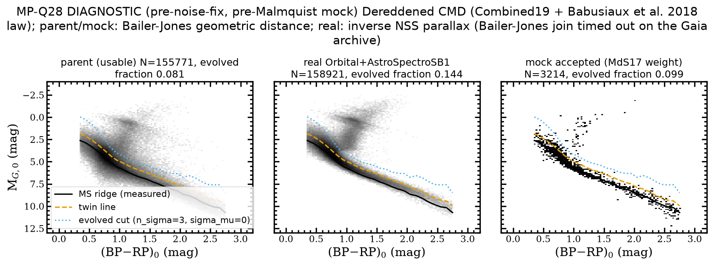
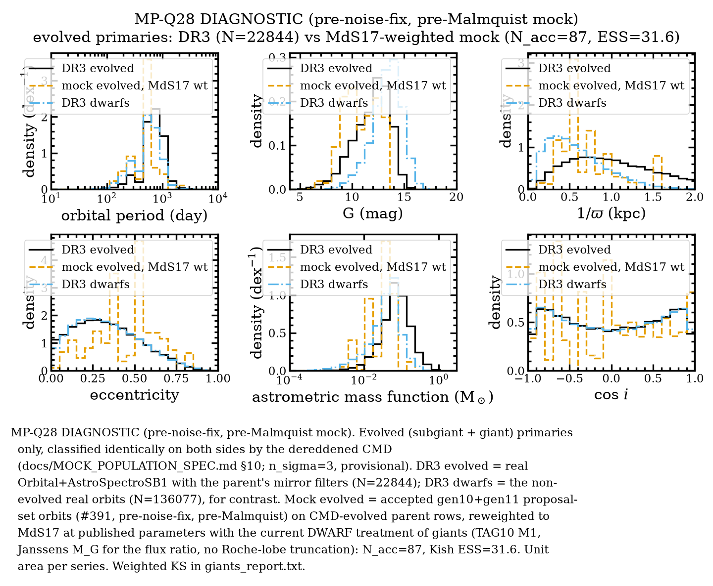
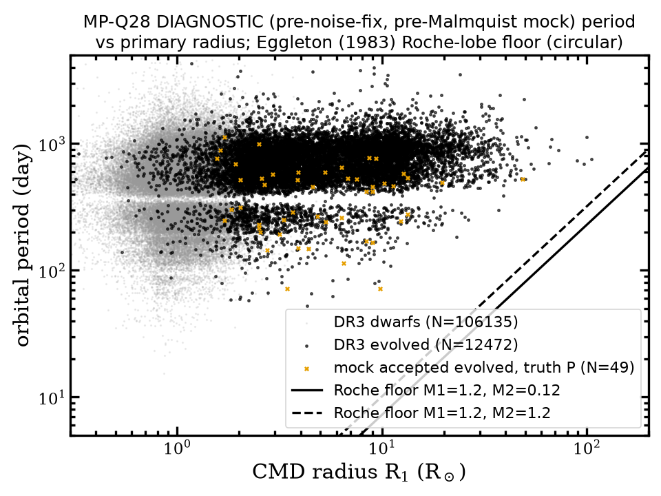
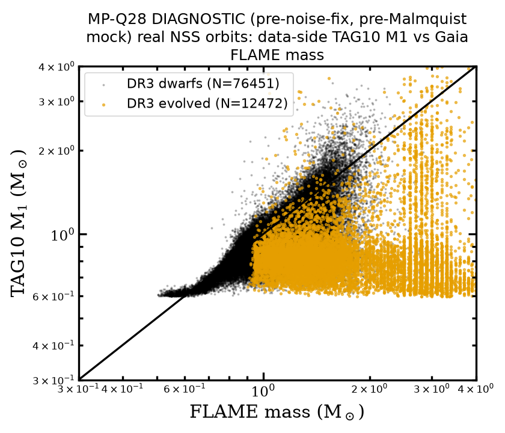

# MP-Q28: giants in the mock population. DIAGNOSTIC (pre-noise-fix, pre-Malmquist mock)

Issue #413 (parent #391, Ryan's MP-Q28 decision of 2026-10-03: "match the real giant population").
Spec: `docs/MOCK_POPULATION_SPEC.md` §10. Code: `src/darkhunter_pop/giants.py`,
`config/population/giants.yaml`, `scripts/giant_population_diagnostics.py`.
Full numbers: `giants_report.txt`.

**Status: diagnostic only.** The mock side is the paused #391 generation 10 + 11 proposal set
(3,549 accepted orbits). It is pre-noise-fix and pre-Malmquist and still uses the dwarf treatment
of giants. No gaiamock was run for this ticket.

## How it was made

```
PYTHONPATH=src .venv/bin/python3 scripts/giant_population_diagnostics.py \
  --artifact ../mock-population-decisions-391/output/proposal_set/decided_gen10_tune.h5 \
  --artifact ../mock-population-decisions-391/output/proposal_set/decided_gen11_partial.h5 \
  --parent-dir data/dr3/gaia_snapshots/20261002T234408Z_gaia_source_parent_K1000000_plx0p2_bj \
  --real-snapshot data/dr3/gaia_snapshots/20260826T234425Z_3d3f740b080c/query.ecsv \
  --flame-snapshot data/dr3/gaia_snapshots/flame_enrichment/query.ecsv \
  --out-dir docs/gate_giants
```

- **Real-side distances are the inverse NSS parallax.** `scripts/fetch_nss_bailer_jones.py`, which
  joins `external.gaiaedr3_distance`, failed on the Gaia archive. The full job ran for 30 min with
  no result, and a 5-row test returned HTTP 500 "statement timeout" (archive-side, like #184). The
  real orbits have ϖ/σ_ϖ 5th / 50th percentiles of 29 / 81, so 1/ϖ is adequate. Re-run with
  `--real-bj-dir` once the archive answers (MP-Q28g).
- The parent and mock use the Bailer-Jones geometric distance (MP-Q4). Extinction is Combined19
  (MP-Q29) with the Babusiaux et al. (2018) Gaia law.

## Giant (evolved) fractions

| Sample | Evolved, CMD, n_σ = 3 |
|---|---|
| Parent, usable and classified (155,771) | **8.12% ± 0.07%** (14.2% at ϖ/σ_ϖ ≥ 20) |
| Real Orbital + AstroSpectroSB1 (158,921) | **14.37% ± 0.09%** |
| Real Orbital only | 9.98% |
| Real AstroSpectroSB1 only | 31.3% |
| Mock accepted, MdS17-weighted | **9.9% ± 1.4%** (raw 2.7%; evolved ESS 31.6) |
| Old TAG10-log g flag: parent / mock accepted | 0.32% / 1.07% |

The mock cascade produces Orbital solutions only, so the like-for-like comparison is the real
Orbital 10.0%, which the mock matches. The fractions agreeing is not evidence that the giants are right: the
six-panel below shows the mock's evolved orbits are wrong in P, f_m and e.

## Figures



The dereddened CMD on each side, with the measured MS ridge, the twin line and the evolved cut.



Evolved primaries, real against mock. The mock's evolved orbits have shorter P (median 517 d
against 701 d), smaller f_m (median 0.039 against 0.072 M⊙, with the mock tail cut near 0.06) and
higher e (median 0.49 against 0.32). The weighted KS gives p < 10⁻⁶ for P and f_m and p ≈ 0.007 for
e, at n_eff = 32. cos i is consistent (p = 0.999).



Period against CMD radius. The Eggleton Roche floor at the current radius lies below the NSS
window, and 0 of 49 accepted mock evolved draws violate it. The real lower envelope rises with R1:
P5 = 259, 314, 460 and 520 d at R1 = 3–6, 6–12, 12–30 and > 30 R⊙. Real dwarfs have P5 = 226 d. The
mock has P5 = 127–245 d in the same bins.



Data-side TAG10 M1 against FLAME mass for real orbits. For evolved stars the median ratio is 0.52;
for dwarfs it is 0.92. For the evolved orbits, the atmosphere TAG10 uses has a median log g of 4.51,
always from MSC.

## Other measurements

- **Companion light.** For draws on evolved rows, the target's dwarf-relation flux ratio has median
  log10 f = −1.22. The ratio implied by the observed system light (spec §10.4) is −3.43, about
  2 dex fainter.
- **Malmquist.** The companion brightening δ has weighted 50th / 90th / 99th percentiles of
  0.0004 / 0.010 / 0.115 mag. W = 1 is therefore correct for evolved rows (spec §10.6), provided it
  reads the CMD flag.
- **RUWE.** The parent's own RUWE at fixed G is not higher for evolved rows (table in
  `giants_report.txt`, spec §10.7). No giant noise term is needed.

## Options for Ryan

MP-Q28a–g in spec §10.8. **MP-Q28c (M1 for evolved primaries) is generation-time**, so it must be
decided before the #391 restart. The other options are reweightable.
